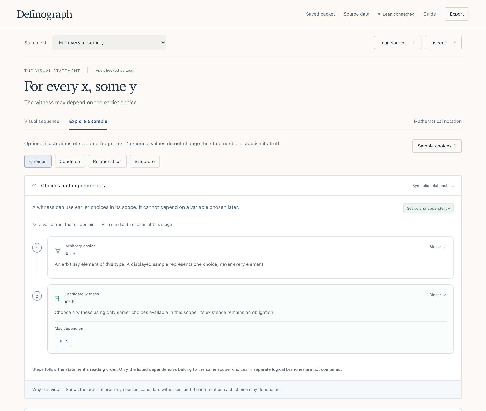
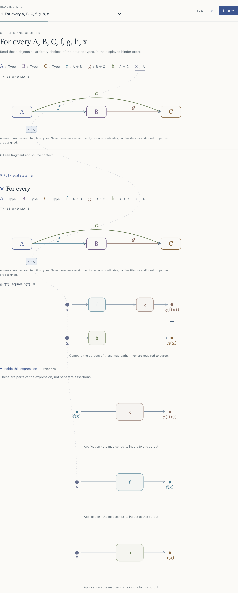

# Definograph

**Read a Lean statement through its objects, relationships and scope.** Definograph is a local mathematical statement reader with linked diagrams, a guided sequence and a VS Code companion. It uses Lean's actual types and definitions, keeps unsupported expressions visible, and separates symbolic structure from optional numerical examples.

[Website and examples](https://definograph.com/) · [Tutorial](https://definograph.com/learn/) · [Current capabilities](docs/status.md) · [Setup guide](docs/editor-integration.md)

Definograph is an experimental research implementation. It does not yet explain arbitrary mathematics. Lean's typing checks do not prove the submitted proposition or certify its visualization.

## See the reader

- **Follow the logic.** Read quantifiers, assumptions and conclusions in sequence, with the whole statement alongside.
- **Trace an object.** Highlight its visible occurrences and inspect maps, inputs and relationships.
- **Inspect structure.** Read direct record fields and laws. In VS Code, [inspect a definition](docs/editor-definition-exposure.md#inspect-from-the-statement) with its actual arguments and scope, then return to the same reading step. Bounded histories retain the recorded checks.
- **Explore supported examples.** View selected set, graph, restricted-map and metric relations. Numerical samples remain separate from the statement's assertions.

The reader uses pure white base surfaces in light mode and pure black in dark mode. The standalone reader follows the system theme; the VS Code companion follows the editor theme. Mathematical regions keep their semantic colors, and dense map diagrams scroll while preserving readable labels.

For example, enter this statement term:

```lean
∀ x : ℝ, ∃ y : ℝ, x < y
```

Here the choice of `y` may depend on the earlier `x`. Reversing the quantifiers asks for one `y` that works for every `x`. The reader makes this dependency visible; it does not supply a witness or a proof. See the [recorded examples](https://definograph.com/examples/) for broader views and their exact source statements.



*Recorded Choices view: `y` may depend on the earlier `x`; its existence remains an obligation. [Exact Lean source](website/source-assets/views/views-6/depends-app-context/source.lean).*

<details>
<summary>Trace an object through a statement about two map paths</summary>



*The dotted thread links visible occurrences of the selected `x` across the guided step and full statement. The thread's route carries no mathematical meaning. [Exact Lean source](website/source-assets/views/views-6/paths-identity-trace/source.lean).*

</details>

Both images were recorded from the reader on 28 September 2026 with Lean 4.28.0.

## Run locally

Requirements: **Node.js 22.12+** and an existing **Lean 4.28.0** executable. Retained setup evidence covers macOS arm64 with Node.js 24.18.1. Linux, WSL and minimum-version compatibility remain unqualified; native Windows linking is not implemented.

```sh
git clone https://github.com/N-Y-L/definograph.git
cd definograph
npm ci --ignore-scripts
npm run setup:lean -- \
  --lean /absolute/path/to/lean-4.28.0/bin/lean \
  --download
npm run dev
```

Open [localhost:5173](http://127.0.0.1:5173), choose a statement, and follow **Next**. **Lean source** accepts a statement term, not a file of declarations. For a production build, run `npm run build` followed by `npm start`, then open [localhost:4317](http://127.0.0.1:4317).

Setup pins mathlib to `8f9d9cff6bd728b17a24e163c9402775d9e6a365`. `--download` fetches its dependencies into the ignored `.local/` directory and can use several GB. Alternatively, pass `--packages /absolute/path/to/a/built/.lake/packages` for an existing matching cache. Setup does not install Lean or change Elan defaults. See the [setup contract](docs/lean-contract.md) and [installation qualification](docs/editor-integration.md#installation-qualification).

### Use VS Code

Install the official Lean extension (`leanprover.lean4`) in VS Code **1.95+**. After building and configuring the reader above, run:

```sh
npm ci --prefix extension --ignore-scripts
node --import tsx scripts/verify-local-setup.ts
npm run package --prefix extension -- --out /absolute/path/to/new/definograph-0.7.1.vsix
```

Choose a new output path; packaging refuses to overwrite an existing VSIX. Use **Extensions: Install from VSIX…**, then set `statementLens.engineDirectory` in VS Code **User settings** to this matching built checkout's absolute path. In a trusted Lean 4.28.0 project with built imports, run **Definograph: Visualize Selection**.

A selected proof opens **Statement of your selected proof**, its inferred proposition with the recorded context. **Inspect a definition in this statement** keeps the original reading alongside a searchable list of actual applications. An inspection shows its recorded result and individual check outcomes; an opaque or unsupported head reports its boundary. **Return to reading** restores the exact step.

The VSIX contains the extension controller only. The reader assets, native engine, toolchain and compiled imports remain separate prerequisites. Source is available here; there is no qualified one-click installer or Marketplace release. The [editor guide](docs/editor-integration.md) covers assembly, supported journeys and failure states. Retained `StatementLens` module names and `statementLens.*` settings are compatibility identifiers.

## Architecture and boundaries

```text
Lean term or trusted editor buffer
  → elaborated expressions, context and recorded checks
  → scoped structure and supported mathematical interpretations
  → guided reading, diagrams and explicit interpretation gaps
```

The standalone reader, editor inspections, saved packets and raw source-data view have different contracts. The [reader relation table](docs/reader-relations.md) and [documentation index](docs/README.md) explain their scope. Imported snapshots remain unverified records; a stored outcome does not certify the current source.

Editor mode re-elaborates the **whole trusted active buffer**. Lean commands and elaborators can execute code; this is not a security sandbox. Analysis runs locally without a model API or cloud service. See the [execution boundaries](docs/editor-integration.md#execution-and-isolation-limits).

The [architecture decision](docs/design/architecture-decision.md) and [roadmap](docs/roadmap.md) describe the compositional engine still to be completed. Their acceptance gates are research goals, not established universal coverage. The [code map](docs/architecture.md) describes the implementation.

## Develop

Portable checks need no Lean setup or download:

```sh
npm run build
npm run check:reader-drivers
npm test
npm run test:server
npm run test:source-dependency
```

With the pinned native worker configured, `npm run check` adds the native integration suites. With extension dependencies installed, `npm run check:extension` checks and packages the controller. See [CONTRIBUTING.md](CONTRIBUTING.md) for development guidance. The public website has a separate, reproducible build in [website/README.md](website/README.md).

## License and credits

The application is available under [Apache License 2.0](LICENSE); reused dependencies retain their own terms in [NOTICE](NOTICE). The separately maintained [source-capture snapshot](vendor/DefinographCapture/README.md) records its exact upstream provenance. No upstream license file was present at that pin, and this repository does not add a license to that snapshot.

The 0.7 prototype was developed by Codex. The architecture decision and further development are by Claude. Both worked under the supervision of Neil Yuanting Li.

[Lean](https://github.com/leanprover/lean4) and [mathlib](https://github.com/leanprover-community/mathlib4) provide the formal environment. [LeanTeX](https://github.com/kmill/LeanTeX), KaTeX, CodeMirror and React support the interface. Exact reuse and attribution are recorded in [NOTICE](NOTICE); citation metadata is in [CITATION.cff](CITATION.cff).
